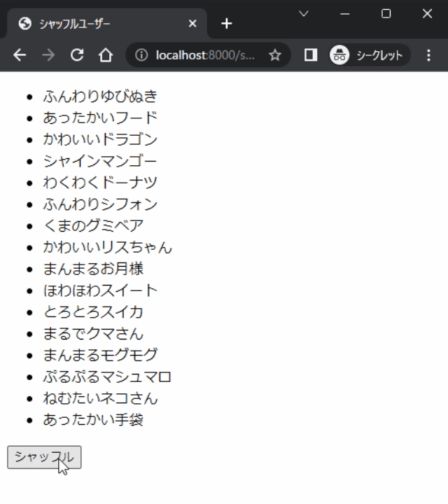

# 配信向け一覧シャッフルプログラム

## Demo



## 事前準備

以下のコマンドを実行して必要なライブラリを取得してください(初回のみ)

```
 curl -O https://raw.githubusercontent.com/ics-ikeda/shuffle-text/main/build/shuffle-text.min.js
```

users.txt.template を users.txt にリネームして配置します。

## 使い方

1. users.txtの中身をシャッフルしたい内容に書き換えます。
1. このフォルダの中身を適当なHTTPサーバーで起動します。Python 3が入っている環境ならば以下のコマンドで起動します。
    ```
    python -m http.server 8000
    ```
1. 以下のURLにアクセスします。(OBSに読み込ませるでも可)
    ```
    http://localhost:8000/shuffleusers.html
    ```
1. シャッフルボタンを押すと内容をシャッフルして表示します。
1. user.txtの内容を書き換えた後、シャッフルボタンを押すと、書き換えた内容を読み込んでからシャッフルを行います。
1. ブラウザを閉じたりしても、シャッフル時に用いたSeedを保持しているため、前回の状態を再度表示することが可能です。

